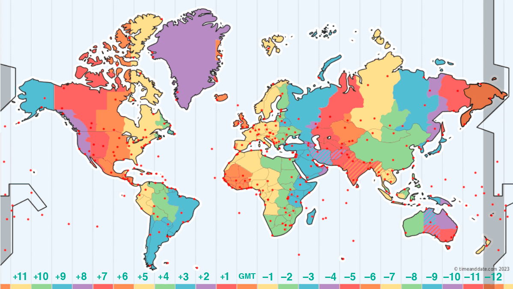

# Daily Quote is a Telegram bot that sends you motivational quotes everyday! 🤖🚀🍀

This is a motivational quote bot designed to inspire and uplift users with daily doses of wisdom and positivity. With it, users can schedule daily motivational messages, receive random quotes on demand, and explore a variety of themed quotes to suit their mood and interests.

## Key Features 👀

- 📅 **Scheduled Messages**: Set your timezone and preferred time to receive daily inspirational messages.
- 💬 **On-Demand Quotes**: Get a random quote anytime. You can even specify a theme, like "/quote love" for love-themed quotes.
- 😎 **Flexible Commands**: Commands like /start, /set, and /unset make it easy to customize your experience.

## Usage ℹ️
### Getting Started

  

  - First things first, you can start your experience with "/start".

  

### Timezone Map

- The map may look confusing at first, but don't worry! You can guide yourself using the bottom numbers, each number is associated with a color in the map, for example: +3 is blue, and this color is painted on East Brazil, Argentina and Chile, this means that those locations uses GMT+3.
  

### Scheduling Daily Quote

  
  
  - After the timezone is selected, now it's time to schedule the quote. Use "/set <hour>:<min>" to do so. <b>Attention: Use 24-hours format.</b>

  

## Disclaimmer ©️
This bot was made thanks to Quotes API, made by the API Ninjas Team, and the open-source library python-telegram-bot.
- [Quotes API by API Ninjas](https://api-ninjas.com/api/quotes)
- [Python Telegram Bot repository](https://github.com/python-telegram-bot/python-telegram-bot)

## In need of a daily dose of inspiration or just a quick pick-me-up? The bot has you covered. 💪🏼
  
<a href="https://t.me/Moti_quote_bot"> 
  <button>  </button>
</a>
